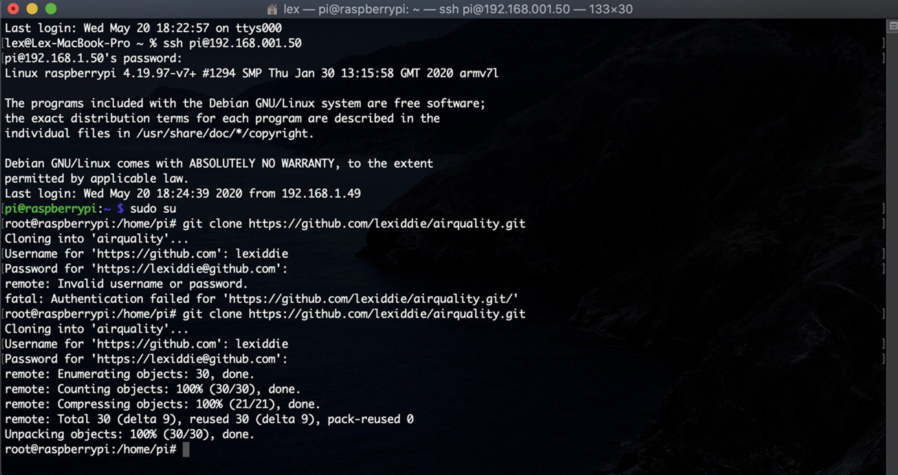

# SparkAir: Air Quality Monitoring System

 

## Abstract

Nowadays, humans are inventing automated systems to assist human lives and improve businesses around the world. In addition, before humans embraced technologies, they usually worked manually to obtain the data in the real world, which takes lots of time and is inefficient due to requiring many human’s workload and payment. Again, since everyone in this century is adopting technologies, many things gained from those technologies.

 

## What is IoT?

The IoT is a system of interrelated computing devices, mechanical and digital machines, objects, animals, or people that are provided with unique identifiers and the ability to transfer data over a network without requiring human-to-human or human-to-computer interaction.

 

## Introduction: Air Quality Monitoring System

Air Quality Detection System is a system to detect air pollution to define the current level regarding the air pollution level indexes. Additionally, sources of air pollution include gases such as ammonia, carbon monoxide, sulfur dioxide, nitrous oxides, methane, and chlorofluorocarbons.

 

## Why is this system important?

There are several reasons that make this system vital to our lives. First, it provides real-time information from any specific location regarding the air quality of that location to inform which current air quality level has occurred. Moreover, it can save human lives by alert them to protect themselves from air pollution. Second, this system offers comprehensive information like Fine Particles (PM 2.5) and (PM 10). PM 2.5 is the most dangerous type of micro Fine Particles that is very hazardous when PM 2.5 is above 300 levels of AQI. Third, it updates data in seconds to comprehend information to users into their smartphones. Again, most people nowadays are bound to smartphones more than any devices out there which mobile application is essential when it comes to comprehensive information to be more effective. Fourth, it provides a full report of the air quality index’s information with a specific date and time.
Additionally, users can look through those data from their mobile application that provides function history. Fifth, it also has a specific location of the air quality detection system collected from the device. Again, to provide full perceptibility to users at any time and anywhere.

 

## System Architecture & Diagram

There are several technologies that this system has used to implement;

- Raspberry Pi
- SDS011 Sensor
- Google Cloud Platform (Firebase)
- iOS Swift (Mobile App)
- Node.js (Web Server & Middleware)
- HTTP Protocol

Air Quality Detection System’s architecture is a microservices architecture. There are three tiers in this system that work independently to have its persistence to maintain the unit. Again, the frontend unit will not be allowed to communicate through a service that collects data directly from Sensor, and it can only communicate with another service through the HTTP protocol of Google Cloud Firebase.

The microcontroller of this system is Raspberry Pi which handles local communication and computation with SDS011 Sensor that collects data from the air in seconds. Moreover, Raspbian OS runs on Raspberry Pi facilitates the middleware which Node.js is building to handle commutation to send data in real-time from Sensor with local DateTime to Google Cloud (Firebase). Furthermore, Google Cloud (Firebase) has SDK’s function for iOS to trigger and load new data every time Google Cloud (Firebase) receives new data from the middleware that Raspberry Pi is running.

 

## SDS011 Sensor Evaluation

The SDS011 Sensor is an affordable Air Quality sensor developed by Nova Fitness, a spin-off device from the University of Jinan in Shandong.

- Specifications
  - Output: PM2.5, PM 10
  - Measuring Range: 0.0-999.9μg/m3
  - Input Voltage: 5V
  - Maximum Current: 100mA
  - Sleep Current: 2mA
  - Response Time: 1 second
  - Serial Data Output Frequency: 1 time/second
  - Particle Diameter Resolution: <= 0.3μm
  - Relative Error: 10%
  - Temperature Range: -20~50°C
  - Physical Size: 71mm 70mm 23mm

SDS011 Sensor is reliable to operate in humidity working range between 0-70%. However, when humidity is above 70%, the reading becomes unreliable to operate.

National Dutch Institute for Public Health and the Environment (NDIPHE) has tested this SDS011 Sensor and confirmed that this Sensor’s results are promising to the official data they have experimented with. However, the Sensor’s measurement gets high when the humidity is high and too low with dry conditions. Again, the official said that developers should calibrate the Sensor depends on the environment’s humidity. Additionally, the developers should not consider the measurements when it rains or on very dry days.

 

## How to deploy and integrate middleware into Raspberry Pi with Sensor?

First, start setting up Raspberry Pi by installing Raspbian OS on the device, and then start setting up credentials to log into the microcontroller with SSH enabled. Again, NodeJS must be installed to facilitate middleware that uses a JavaScript runtime environment. Moreover, the next step is to remote to Raspberry Pi via Secure Shell (SSH) and install Git CLI to pull this repository from GitHub built as a middleware for handling data into Google Cloud (Firebase).

Additionally, change the directory into the project folder and install NPM packages by using the “npm install” command and running the middleware with the “npm start” command to start the middleware.

As a result, the middleware starts to receive data from SDS011 Sensor and with DateTime to send into Google Cloud (Firebase). Also, iOS Mobile Application uses Firebase SDK, which has real-time data when Cloud receives new data into storage.

 

## About Air Quality and Pollution Measurement

[Source AQI China](https://aqicn.org/)

 

## Preliminary Test of The System

There are several substances that have been used to test with the system:

- The Sunlight Dishwashing Liquid with water and spray around the Sensor. As a result, the average value of PM2.5 is 12.7 and PM10 is 50.7, which is not harmful due to the value of PM2.5 is low, and the microparticle of the spray is very low.
- It was tested with perfume which most people use every single day. As a result, its average PM2.5 is around 16.20, and PM10 is around 23, then it is not a substance.
- Air pollution mainly comes from smoke, so it has been tested with a cigarette, which result is as promising as the official, its average of PM2.5 is around 350, and PM10 is around 700.

As a result, it is very harmful and hazardous to the lung and eyes.

 

## Open Source Libraries Use

There are several open sources libraries that have been used to implement middleware, also known as a web application for handling forward data to Google Cloud Platform (Firebase). First, Express.js is a web application framework for Node.js, and it was released as an open-source library as run on cross-planform in JavaScript runtime environment (Node.js). This framework was designed for building web applications and APIs. Moreover, it is the best and popular web application framework out there. Second, Firebase SDK is a library by Google Cloud Firebase for implementation with intuitive APIs packaged into a single SDK, also known as a software development kit to handle communication between web applications to Google Cloud through HTTP Protocol that’s being implemented by Google Inc. Fourth, since the middleware is built with JavaScript frameworks and Node Engine Environment, JavaScript itself does not have any built functionality to allow to access the serial port. However, Serialport.js is a serial combination library used to communicate a machine’s serial port through JavaScript. Again, the SDS011 uses the USB port that connects with Raspberry Pi, and this library helps to handle serial port communication effectively. Last, the SDS011 Wrapper is an SDS011 Sensor library also known as a driver for the SDS011 UART interface.

Moreover, it must have a library to bind with a device with a microcontroller to get the system running. This library comes in handy and makes it easy for developers to focus on specific IoT solutions instead of serial communication. Additionally, developers must choose the right libraries to save time and, more importantly, focus on the solution and preliminary test to get the best results to implement the effective IoT system.

 

## References

[SDS011-Wrapper](https://www.npmjs.com/package/sds011-wrapper)

[SerialPort](https://www.npmjs.com/package/serialport-js)

[Firebase](https://firebase.google.com/docs/web/setup)

[SDS011 via AQI China](https://aqicn.org/sensor/sds011/)

[Accuracy of the SDS011](https://influencair.be/accuracy-of-the-sds011/)

[Air pollution](https://en.wikipedia.org/wiki/Air_pollution)

[National Dutch Institute for Public Health and the Environment](https://www.youtube.com/watch?v=FgvghFFSQ6c)
